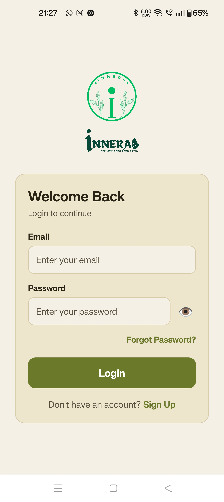
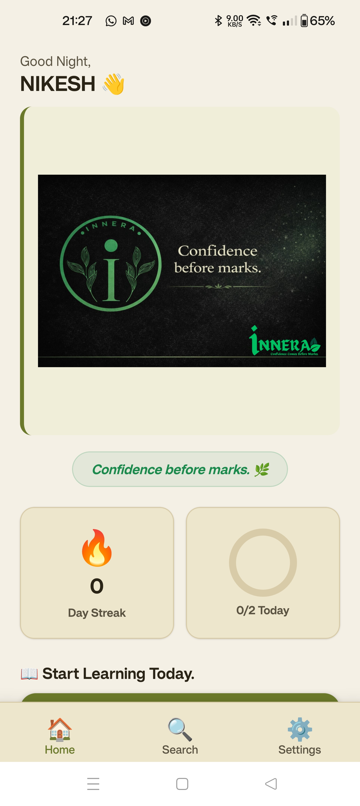
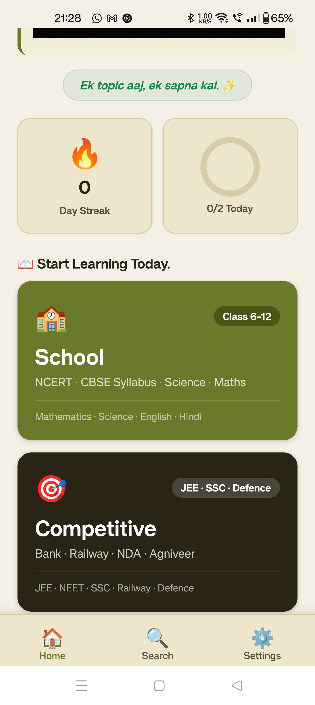
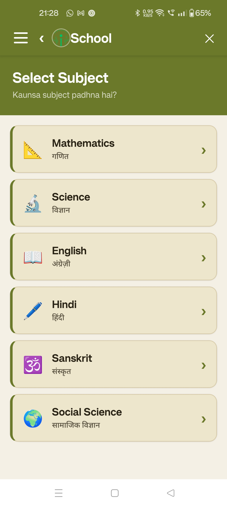
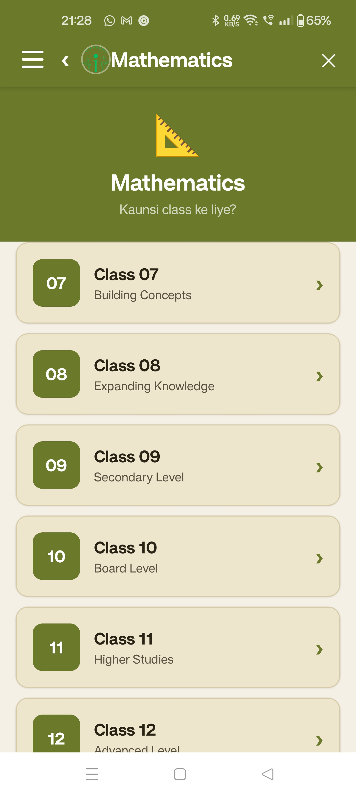
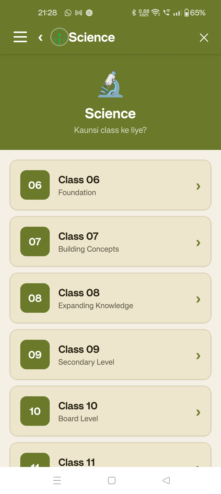
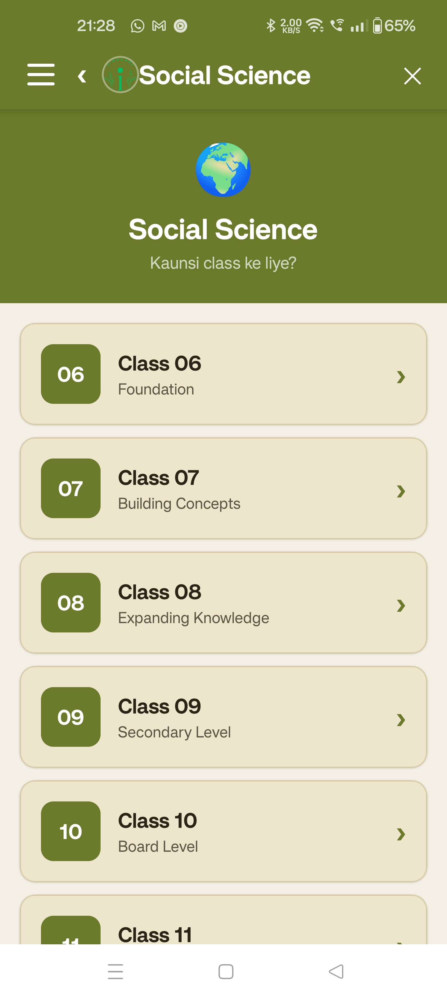
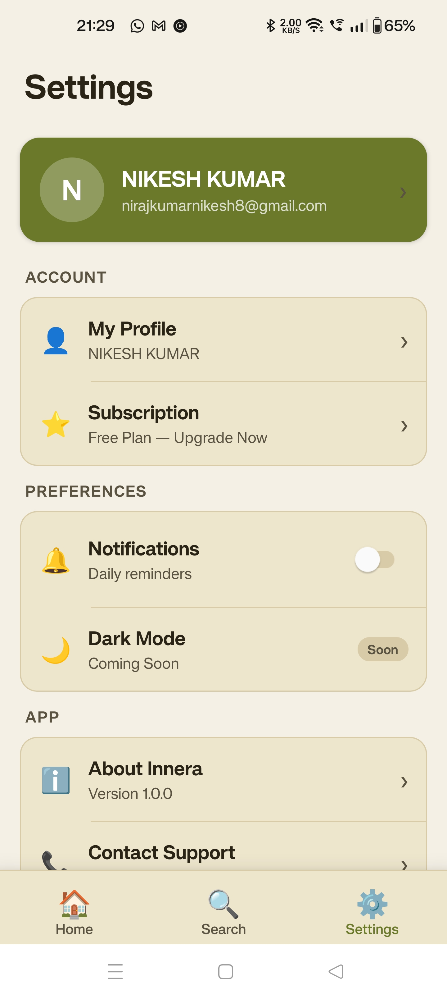

# 🌱 Innera

  

An educational platform designed for structured learning, personalized learning paths, quizzes, and progress tracking.

---

# 📚 About

Innera is a modern educational platform built to help students learn efficiently through organized content, subject-wise navigation, quizzes, and progress tracking.

It aims to provide a simple and engaging learning experience for students and competitive exam aspirants.

---

# 🎯 Target Audience

- School Students
- College Students
- Competitive Exam Aspirants
- Working Professionals

---

# ✨ Features

- 🔐 Login & Signup
- 📖 Subject-wise Learning
- 📚 Chapter Navigation
- 📝 Quiz Support (Coming Soon)
- 📊 Progress Tracking
- 👤 User Profile
- 💳 Subscription System
- 🤖 AI Chat (Coming Soon)
- 🎥 Video Courses (Coming Soon)
- 🎓 Certificates (Coming Soon)

---

# 🛠 Tech Stack

- React Native
- Expo
- TypeScript
- Firebase
- React Navigation

---

# 📱 Screenshots

## Login

## Home

## Subjects

## Mathematics

## Science

## Social Science

## Profile

## Settings

## Subscription

---

# 🚀 Future Roadmap

- AI Tutor
- Live Classes
- Video Courses
- Practice Tests
- Leaderboard
- Offline Learning
- Doubt Support

---

# 👨‍💻 Developer

Nikesh Kumar

---

# 📄 License

This project is licensed under the MIT License.